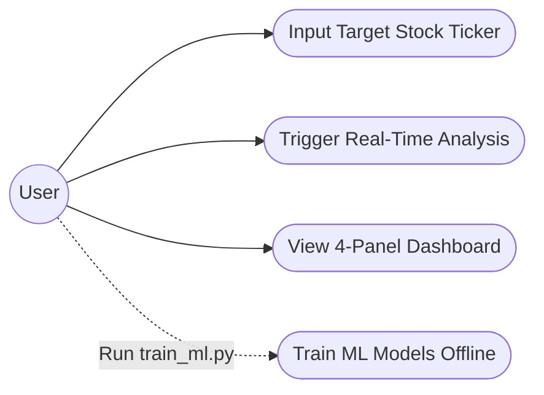
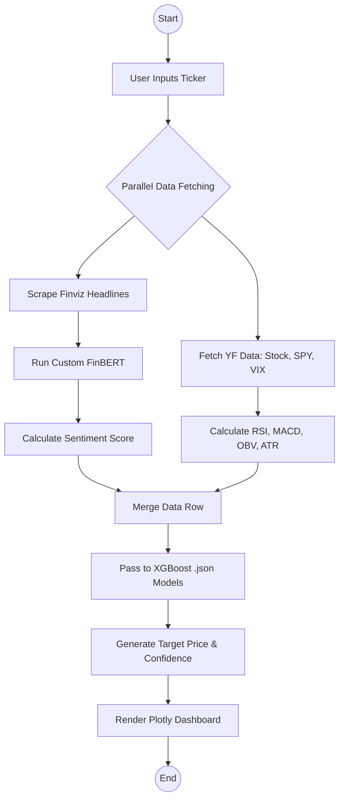
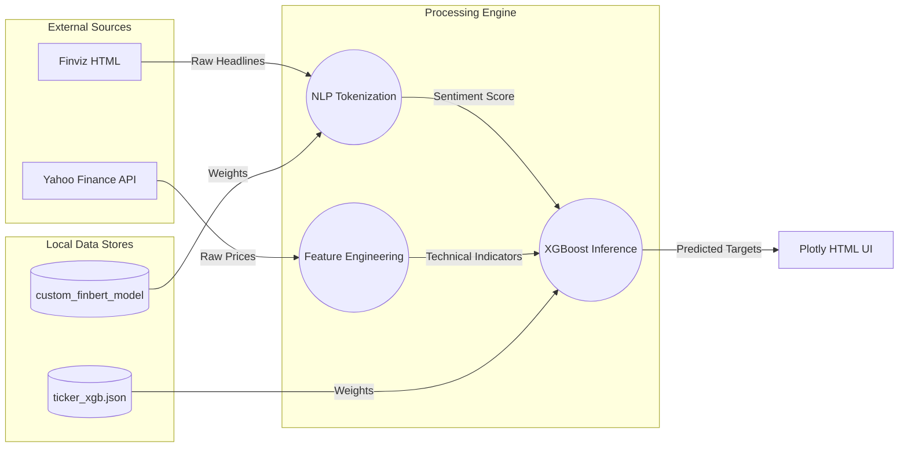
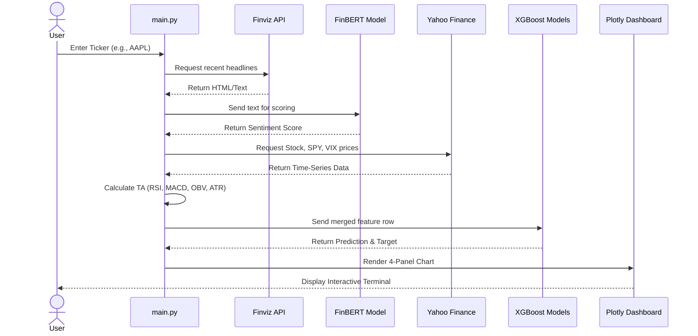

# Real-Time Financial Market Analyser

A professional-grade algorithmic trading pipeline that combines deep learning Natural Language Processing (NLP) with Machine Learning (XGBoost) to predict stock market movements based on real-time sentiment and macro-economic indicators.

## 🚀 Features
* **Custom NLP Engine:** Fine-tuned FinBERT model that scores real-time news headlines from Finviz on a scale of -1.0 (Bearish) to 1.0 (Bullish).
* **Macro-Aware ML:** XGBoost predictive models trained on 4+ years of stock data, factoring in the S&P 500 (SPY) and Volatility Index (VIX) to understand broader market regimes.
* **Smart Money Indicators:** Integrates institutional technical analysis including On-Balance Volume (OBV), Average True Range (ATR), MACD, and RSI.
* **Instant Inference:** Decoupled training and execution architecture allows for sub-second, real-time predictions during market hours.
* **Interactive Dashboard:** Generates a 4-panel institutional-grade Plotly web dashboard for visual analysis of price action, volume, momentum, and target projections.

## ⚙️ Installation & Setup

1. **Clone the repository:**
   ```bash
   git clone [https://github.com/YOUR_USERNAME/YOUR_REPOSITORY_NAME.git](https://github.com/YOUR_USERNAME/YOUR_REPOSITORY_NAME.git)
   cd YOUR_REPOSITORY_NAME
   ```

2. **Create a virtual environment:**
   ```bash
   python -m venv venv
   venv\Scripts\activate  # On Windows
   source venv/bin/activate  # On Mac/Linux
   ```

3. **Install dependencies:**
   ```bash
   pip install -r requirements.txt
   ```

## 🛠️ Usage Pipeline

### Phase 1: Train the Machine Learning Models (Offline)
Run this script to fetch 4 years of historical data, calculate technicals, and train the XGBoost models. This saves the optimized weights locally.
```bash
python train_ml.py
```

### Phase 2: Real-Time Inference (Live Market)
Run this script to fetch the latest news, calculate live sentiment, instantly load the ML models, and generate the Plotly dashboard.
```bash
python main.py
```

## 🧠 System Architecture Breakdown

| Component | Activity | Rationale |
| :--- | :--- | :--- |
| **Live NLP Scraper** | Scrapes top 10 real-time headlines from Finviz and scores them using a custom FinBERT model. | News decays instantly. Live fetching ensures XGBoost has the absolute latest sentiment context before predicting. |
| **Market Data Fetcher** | Downloads live price data for target stock, plus S&P 500 (SPY) and Volatility Index (VIX). | **Macro-awareness.** If the whole market crashes, the AI adjusts its target price accurately instead of viewing the stock in a vacuum. |
| **Feature Engineering** | Calculates RSI, MACD, Bollinger Bands, OBV, and ATR. | Translates raw prices into "Smart Money" momentum indicators to detect hidden institutional buying/selling. |
| **Decoupled ML Loading** | Bypasses training loop to instantly load pre-trained XGBoost brains (`.json`). | **Speed.** Training takes minutes; inference takes milliseconds. Allows dashboard to boot instantly during active hours. |
| **Predictive Engine** | Classifier predicts *Direction* (Up/Down). Regressor predicts exact *Target Return*. | Dual models prevent wild guessing. It mathematically verifies the trend before assigning a dollar value. |

## 📊 System Diagrams

### 1. Use Case Diagram


### 2. Activity Diagram


### 3. Data Flow Diagram (DFD Level 1)


### 4. Sequence Diagram
